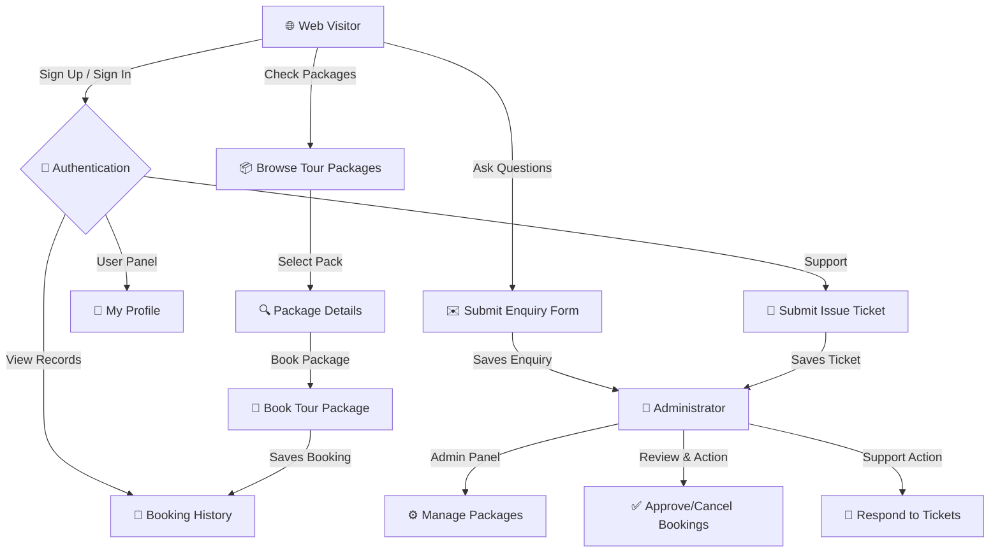
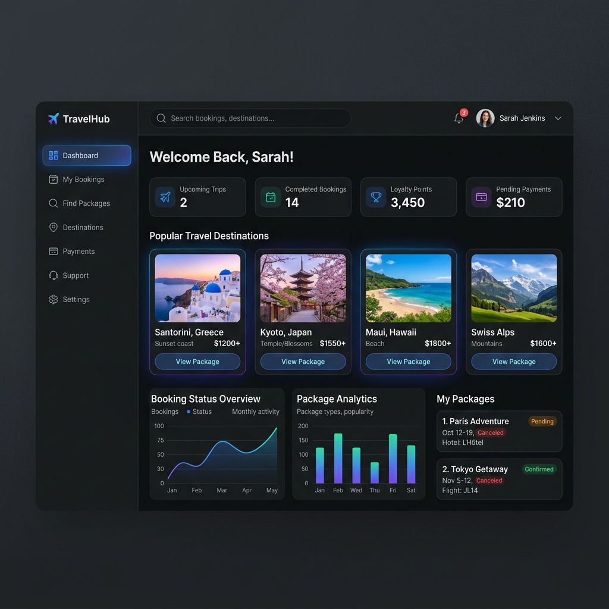

# Tours and Travels Management System

  
  
  
  
  
  

An online Tours & Travels management system developed using PHP and MySQL. This system facilitates complete travel information, vehicle availability tracking, customer enquiries, tour booking history, and admin-led travel management operations.

---

## 🗺️ System Flow & Architecture

The workflow flowchart below outlines how customers and administrators interact with the Tourism Management System:

---

## Features

### 🌟 Customer Flow
- **Tour Booking**: Customers search for tour packages, view detailed itineraries, and request bookings.
- **Availability Check**: Real-time vehicle and package availability tracking.
- **Enquiry System**: Customers can send questions directly to the administrators.

### 🛠️ Admin Dashboard
- **Booking Management**: Approve, reject, and monitor tour reservations.
- **Package Editor**: Create, modify, and delete custom travel packages with images and prices.
- **Issue Tracking & Queries**: Respond to client queries and tickets.

---

### 📸 Travel Destination Gallery

| Paris Escape | Cherry Blossoms in Tokyo | Bali Tropical Paradise |
| :---: | :---: | :---: |
|  |  |  |

---

## Technology Stack

- **Backend**: PHP
- **Database**: MySQL
- **Frontend**: HTML5, CSS3, Javascript, Bootstrap

## Software Requirements

- WAMP Server or XAMPP Server
- Web Browser (Chrome, Firefox, Edge, etc.)

## Installation & Configuration

1. **Download & Extract**: Extract/unzip the project folder.
2. **Move to Server Directory**: Place the extracted folder under your server's public directory:
   - For XAMPP: `C:/xampp/htdocs/`
   - For WAMP: `C:/wamp/www/`
3. **Database Configuration**:
   - Open phpMyAdmin in your browser: `http://localhost/phpmyadmin`
   - Create a new database named `tms`.
   - Import the database schema and data by importing the SQL file located at: `database/tms.sql`.
   - Ensure the database connection settings in `includes/config.php` and `admin/includes/config.php` match your environment (default is set to localhost with root username and empty password).

## How to Run

1. Start your XAMPP/WAMP services (Apache and MySQL).
2. Open your web browser and navigate to: `http://localhost/Tours-and-travels-in-php-master/`
3. For Admin Panel, go to: `http://localhost/Tours-and-travels-in-php-master/admin/`

### Default Admin Credentials

- **Username**: `admin`
- **Password**: `admin`

## Author

- **Name**: Vijay Mahes
- **Email**: [Vijaypradhap2004@gmail.com](mailto:Vijaypradhap2004@gmail.com)
- **GitHub**: [vijaymahes9080](https://github.com/vijaymahes9080)

## License

This project is licensed under the [MIT License](LICENSE).
